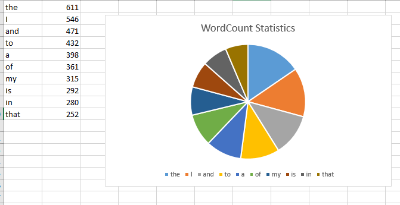

# spark-wordcount

## Data file
- I got the data from the link mentioned in Dr.DeniseCase's repo: (https://github.com/denisecase/setup-spark)
- The data in the text file is already clean. So I have not performed any commands related to cleaning.
- Run Powershell as Administrator and command to start Spark with Scala: ```spark-shell```
## Steps for processing data using Spark & Implement word count (Finding the top 10 most used words)

### Step1: Creating an RDD using local text file or any remote file link
```scala> val romeoRDD = sc.textFile("C:/rj.txt");```

### Step2: Mapping the words and then applying aggregation using reduceByKey
```scala> val wordCounts = romeoRDD.flatMap(line => line.split(" ")).map(word => (word, 1)).reduceByKey((a, b) => a + b)```

### Step3: Displaying the content
```scala> wordCounts.collect()```

### Step4: Sorting the result in descending order
```scala> val sortedResult = wordCounts.sortBy(_._2,false);```

### Step5: Definition for writing into a local file
```scala> def writingToAFile(f: java.io.File)(i: java.io.PrintWriter => Unit) { val p = new java.io.PrintWriter(f) try { i(p) } finally { p.close() } }```
                     
### Step6: Taking first 10 results into a value
```scala> val res10 = sortedResult.take(10);```

### Step7: Calling the function to write into the file
```scala> import java.io._```
```scala> writingToAFile(new File("C:/output.txt")) { p => res10.foreach(p.println) }```
## Visual Report


## References
- (https://github.com/denisecase/setup-spark)
- (https://blog.knoldus.com/sorting-in-scala-using-sortedsortby-and-sortwith-function/)
- (https://stackoverflow.com/questions/49067997/scala-write-rdd-to-txt-file)
